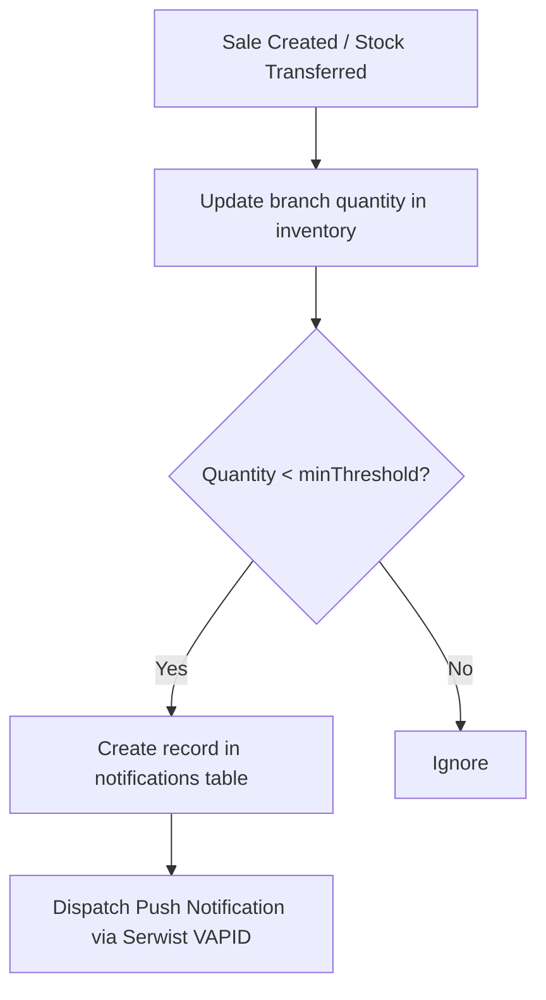

# Milestone 8 Architectural Discovery: Isolation Boundaries & Event Dispatch

This document details the architectural decisions and domain patterns for **Milestone 8: Advanced Multi-Tenant Isolation & Live Alerts**.

---

## 1. Multi-Tenant Query Boundaries

To achieve total database-level tenant security, we avoid manual filtering inside every business logic block. Instead, we implement a centralized procedure boundary inside [trpc.ts](file:///c:/Users/TheAstronautGuy/WebstormProjects/virat-crm/src/server/api/trpc.ts):

### Context & Middleware Isolation

1. **Branch Middleware**: For standard user procedures, inject a middleware check:
   ```typescript
   export const branchIsolatedProcedure = protectedProcedure.use(
     async ({ ctx, next }) => {
       if (ctx.dbUser.role !== "Admin" && ctx.dbUser.role !== "Developer") {
         if (!ctx.dbUser.branchId) {
           throw new TRPCError({
             code: "FORBIDDEN",
             message: "User has no branch assignment.",
           });
         }
       }
       return next({
         ctx: {
           // Expose branchId specifically to procedures
           userBranchId: ctx.dbUser.branchId,
         },
       });
     },
   );
   ```
2. **Procedure Injection**: Within all sales, products, and customer queries, automatically apply a `where` filter:
   ```typescript
   // Example Sales Fetch
   const filters = [eq(sales.branchId, ctx.userBranchId)];
   ```

---

## 2. High-Frequency Indexing Plan

Based on access patterns in the CRM, breadcrumbs, and sales, we will apply several compound indices to ensure queries execute in sub-millisecond ranges:

| Table         | Index Columns             | Purpose                                                             |
| :------------ | :------------------------ | :------------------------------------------------------------------ |
| `inventory`   | `(branch_id, product_id)` | Extremely fast stock level lookup and transfer status verification. |
| `sales`       | `(branch_id, created_at)` | Fast localized historical sales data retrieval.                     |
| `breadcrumbs` | `(user_id, created_at)`   | Fast periodic live location breadcrumb queries (last 15 minutes).   |

---

## 3. Low-Stock Alert Pipeline

We hook into mutations affecting branch inventories (Sales billing, stock transfers, manual inventory edits) to trigger low-stock alerts:


