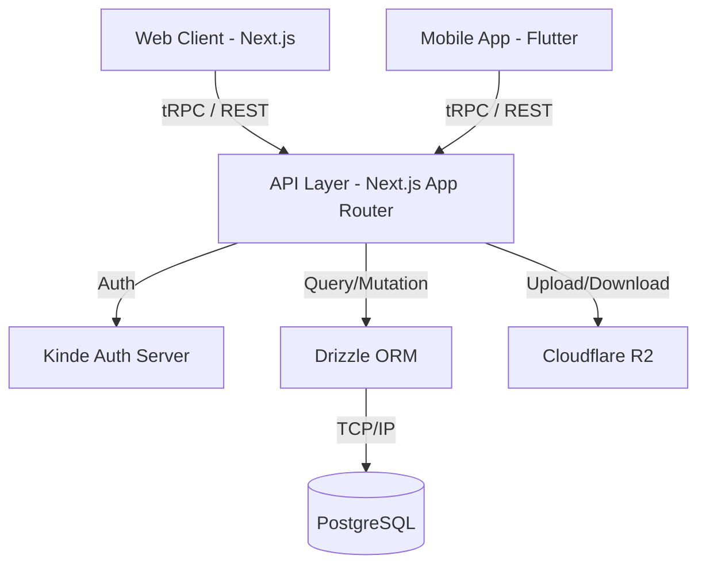

<!-- generated-by: gsd-doc-writer -->
## System Overview

Virat ERP is a comprehensive, self-hosted relational professional management system built on the T3 Stack with a native-like mobile experience. The system is designed to provide secure, role-based access to business functions (attendance, document management, CRM workflows) via a Next.js App Router web application and a Flutter-based mobile progressive application. The architecture is primarily layered, separating presentation, API routing (tRPC and REST), and data access (Drizzle ORM).

## Component Diagram



## Data Flow

1. **Client Request:** A user action on the web or mobile client triggers an RPC call or REST API request.
2. **Authentication & Authorization:** The request hits a protected API route where Kinde Auth middleware verifies the session and ensures the user possesses the required role (`admin`, `manager`, `employee`).
3. **API Processing:** The tRPC router or REST handler processes the request payload, applying necessary business logic (e.g., Haversine distance calculations for geofenced attendance).
4. **Data Access:** The handler interacts with the PostgreSQL database using Drizzle ORM queries, or fetches/uploads files to Cloudflare R2 if document management is involved.
5. **Response:** The data is returned as a strongly-typed response to the client, which updates its local state and UI components.

## Key Abstractions

- **tRPC Routers:** `src/server/api/routers/` - Define all type-safe API endpoints for the web and mobile clients.
- **Kinde Middleware:** `src/server/auth.ts` - Handles user authentication, session management, and role validation before allowing access to protected endpoints.
- **Drizzle Schema:** `src/server/db/schema.ts` - Strongly typed database schema definitions used for queries and migrations.
- **FeatureGate & LocationGate:** Protect specific UI modules and enforce constraints (e.g., mandatory GPS tracking) based on user state and admin toggles.

## Directory Structure Rationale

```text
virat-erp/
├── mobile/               # Flutter source code for native applications (Android/iOS)
├── src/
│   ├── app/              # Next.js App Router pages, layouts, and REST API routes
│   ├── components/       # Reusable UI components (shadcn/ui and custom)
│   ├── server/           
│   │   ├── api/          # tRPC routers and context initialization
│   │   ├── auth/         # Kinde RBAC integration and session handlers
│   │   └── db/           # Drizzle ORM schema, migrations, and database connection
├── public/               # Static assets and PWA manifest
└── styles/               # Global Tailwind CSS styles and theming
```
